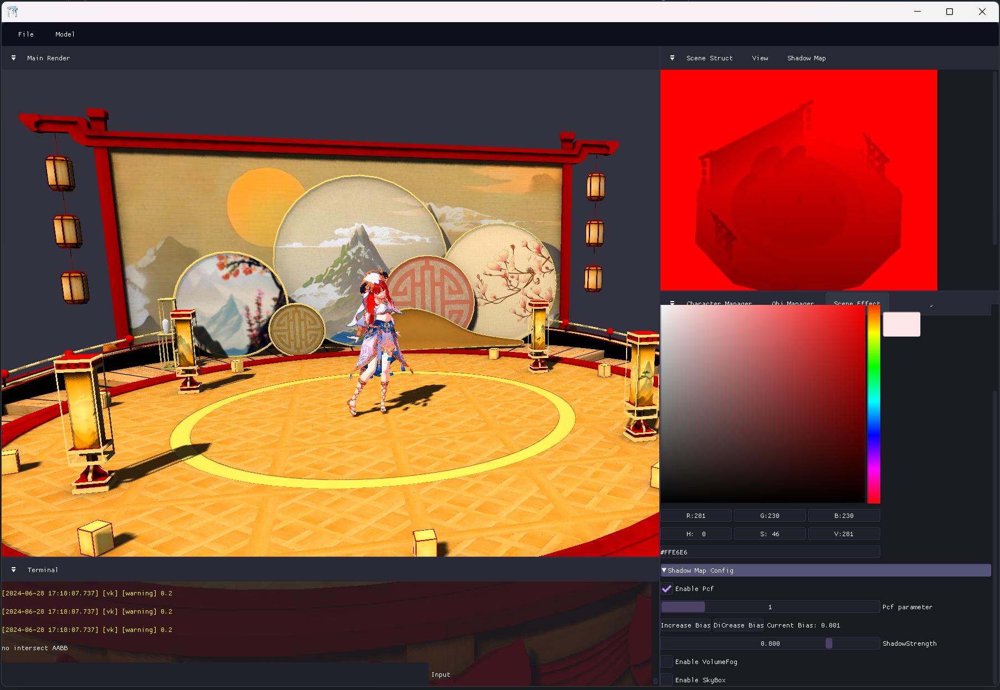
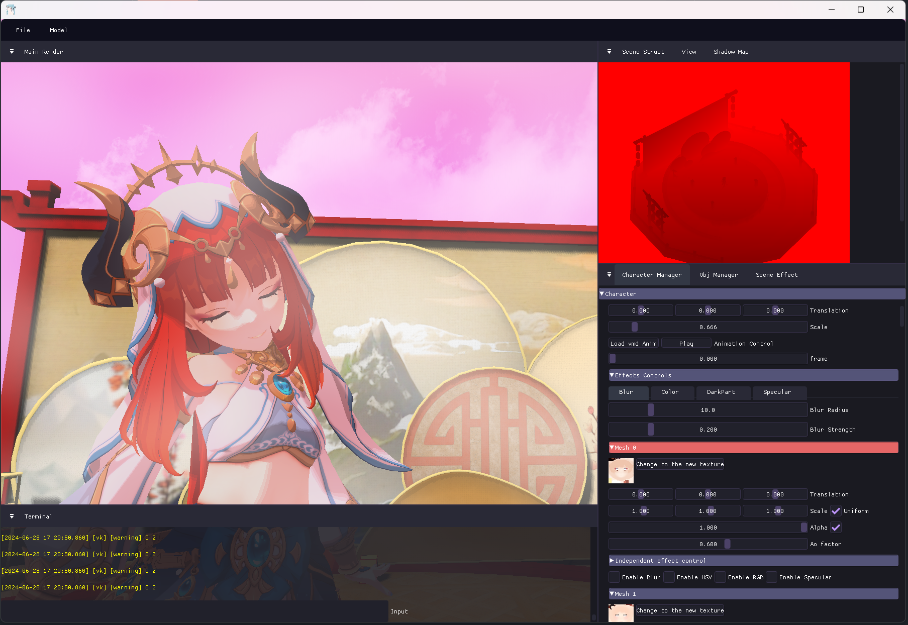
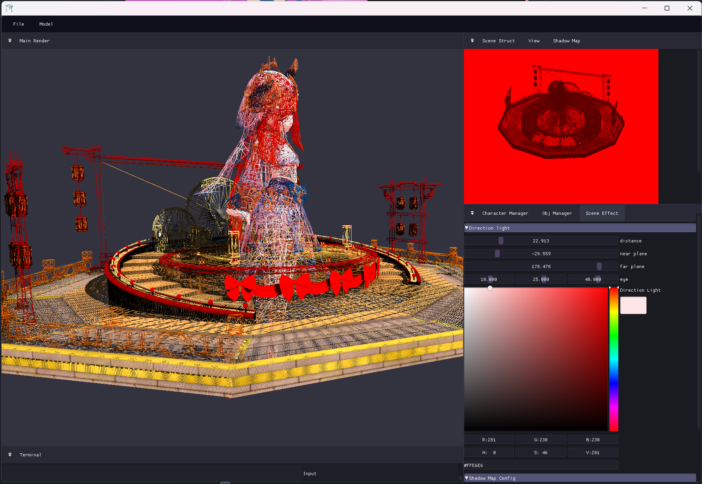
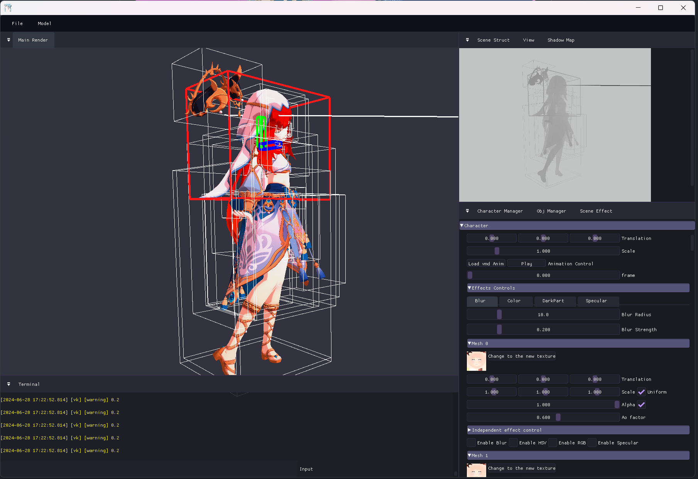
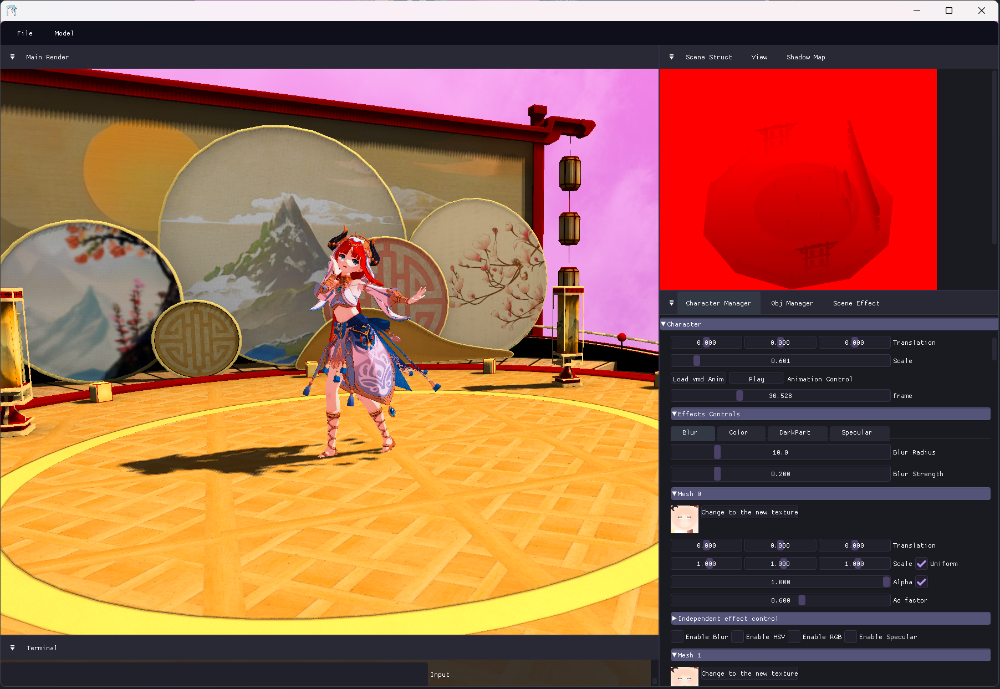

## 功能
- **模型加载**：支持通过文本框加载主流模型格式，可更改模型导入大小。
- **实时渲染效果修改**：可以实时修改渲染效果，可以对单独材质进行效果更新。
- **材质更新**：支持通过拖拽操作更新替换材质。
- **阴影生成**：利用Shadow map生成阴影，支持PCF。
- **基础编辑功能**：提供基础模型编辑操作。
- **VMD动画**：支持加载和播放VMD格式动画。
- **自由摄像机**：支持鼠标右键进入通过WASD键移动。
- **模拟终端**：输出调试信息等。

## 如何构建
- 需要CMake和MinGW
- 需要手动编译Assimp库
- Bullet库参考Saba库下面的配置和编译
- 其他库会通过CMake的FetchContext模块自动下载配置
- 然后应该就可以直接在CLion里面运行了吧 = - =

## 效果图

  
   
<em>模型渲染</em>

  
   
<em>材质更改</em>

  
   
<em>线框绘制</em>

  
   
<em>模型编辑</em>

  
   
<em>vmd播放</em>

