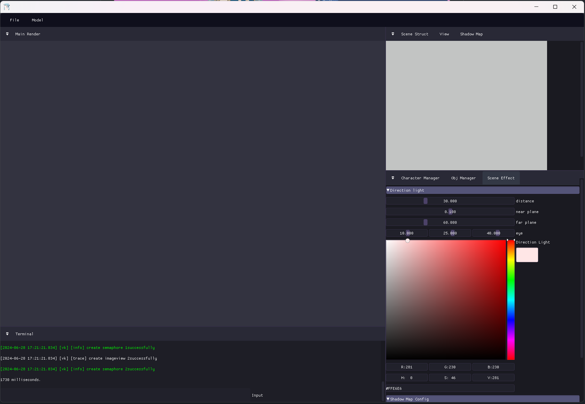

## 功能
- **模型加载**：支持通过文本框加载主流模型格式，并可更改模型导入大小。
- **实时渲染效果修改**：可以实时修改渲染效果，可以对单独材质进行效果更新。
- **材质更新**：支持通过拖拽操作直接更新材质。
- **阴影生成**：利用Shadow map生成阴影，支持PCF。
- **基础编辑功能**：提供基础模型编辑操作。
- **VMD动画**：支持加载和播放VMD格式动画。
- **自由摄像机**：支持鼠标右键进入通过WASD键移动。
- **模拟终端**：输出调试信息等。

### 整体界面

  
   

### 模型渲染

  
   

### 材质更改

  
   

### 渲染效果设置更改

  
   

### 模型编辑

  
   

### vmd播放

  
   

